# fastapi-postgres
Lectura y escritura en base de datos Postgres con FastAPI

## Quickstart

En este ejemplo utilicé GitHub Codespaces pero también se puede ejecutar localmente

### 0 Add port

Solo para GitHub Codespaces

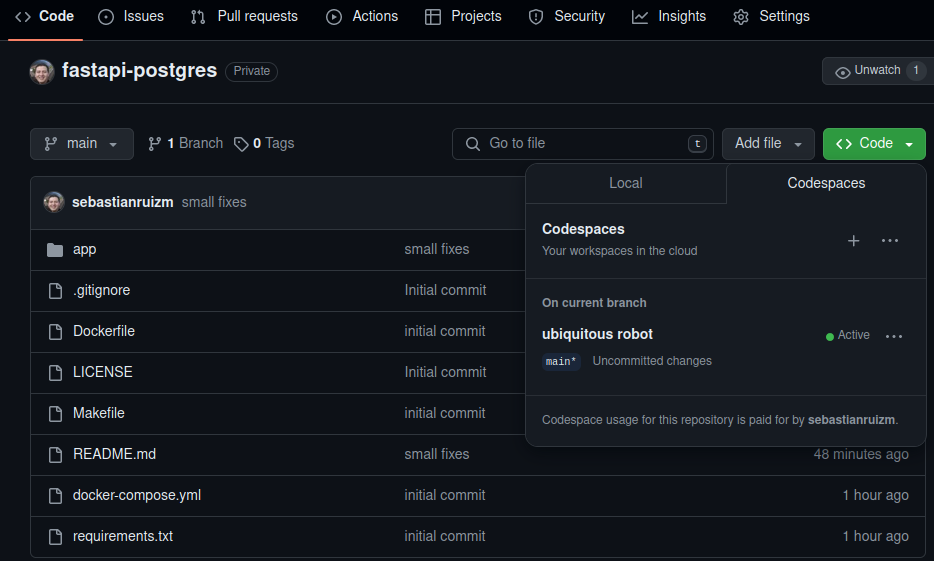

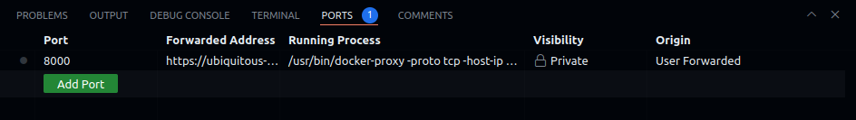

### 1 Build

Ejecutar docker-compose mediante Makefile

```bash
make build
```

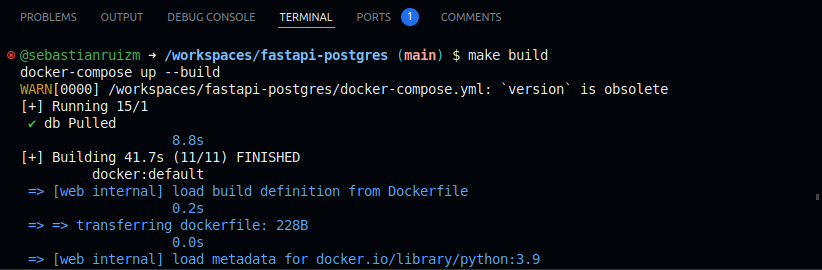

### 2 Check Postgres

Validar que Postgres se está ejecutando correctamente

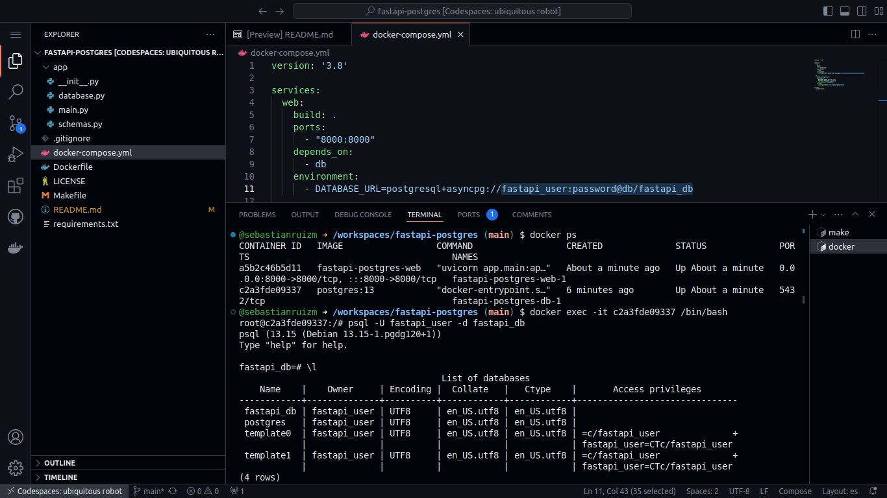

### 3 Check FastAPI

Validar que FastAPI se está ejecutando correctamente

http://0.0.0.0:8000

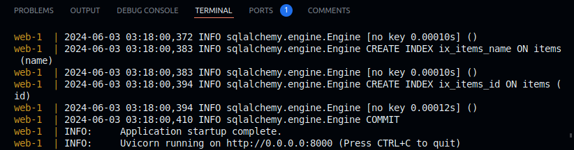

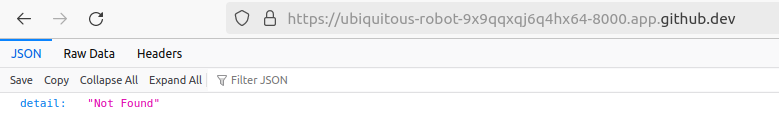

### 4 FastAPI Docs

Acceder a FastAPI docs para interactuar con la base de datos Postgres

http://0.0.0.0:8000/docs

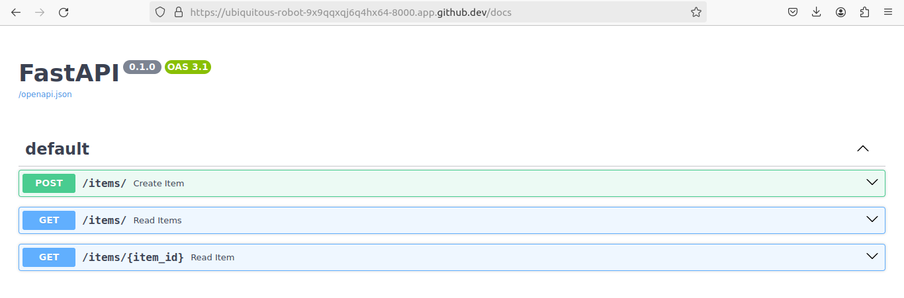

### 5 API POST

Insertar registro en la base de datos mediante método POST

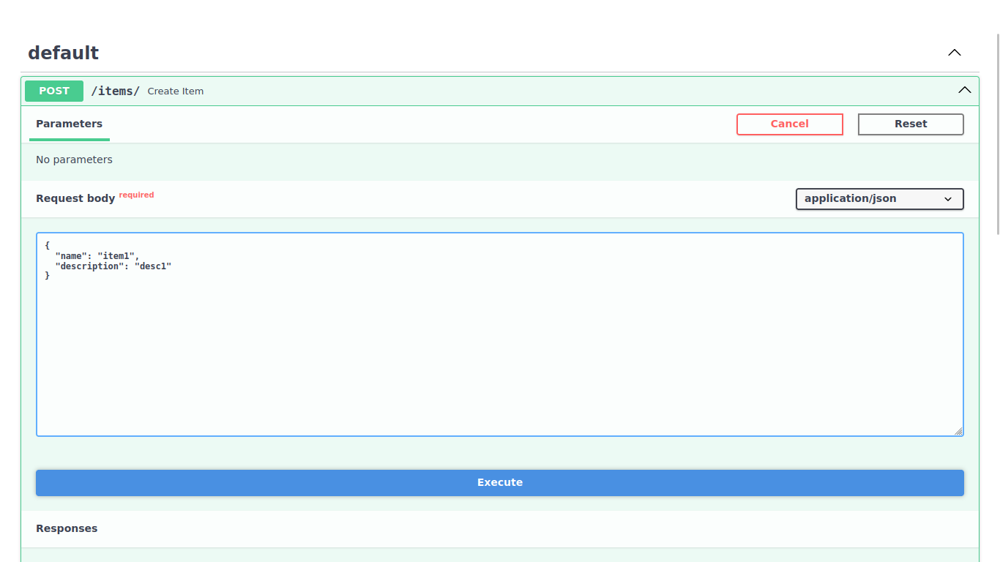

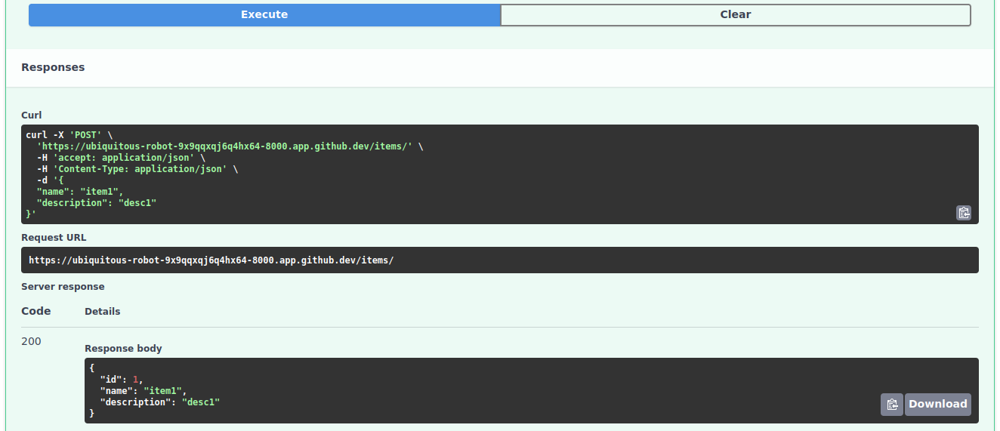

### 6 API GET

Consultar registro en la base de datos mediante método GET

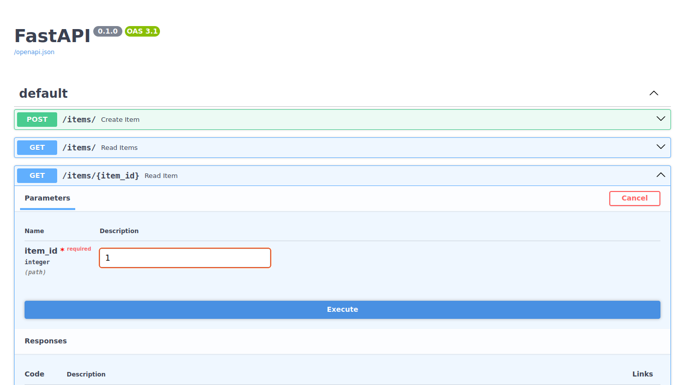

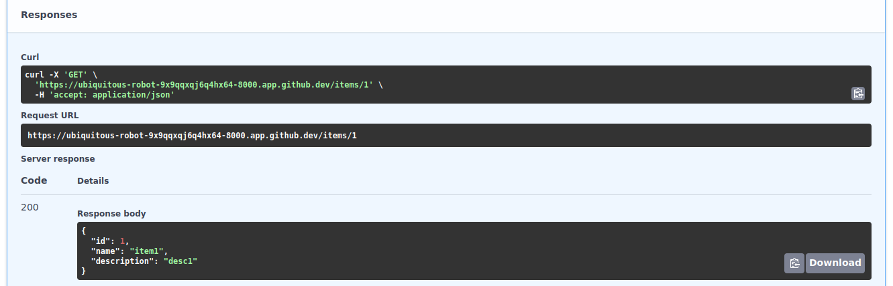

### 7 Validate Postgres

Validar datos en Postgres

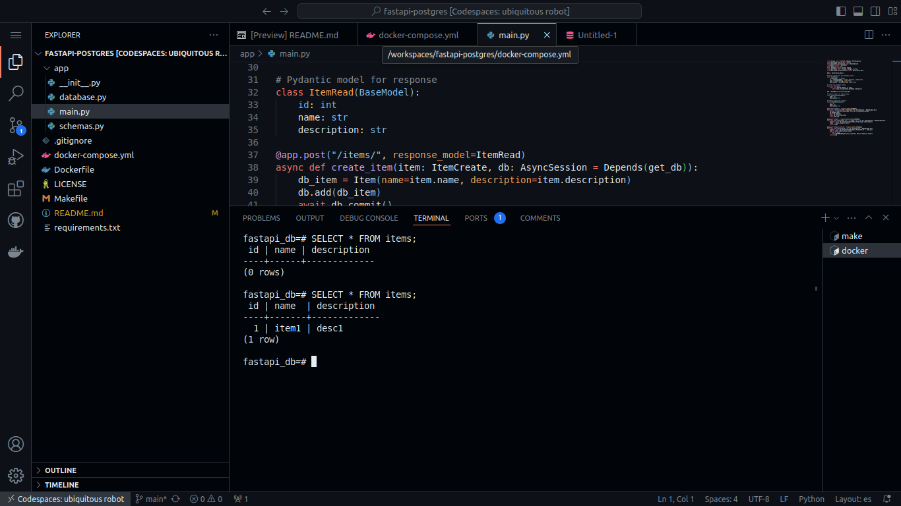